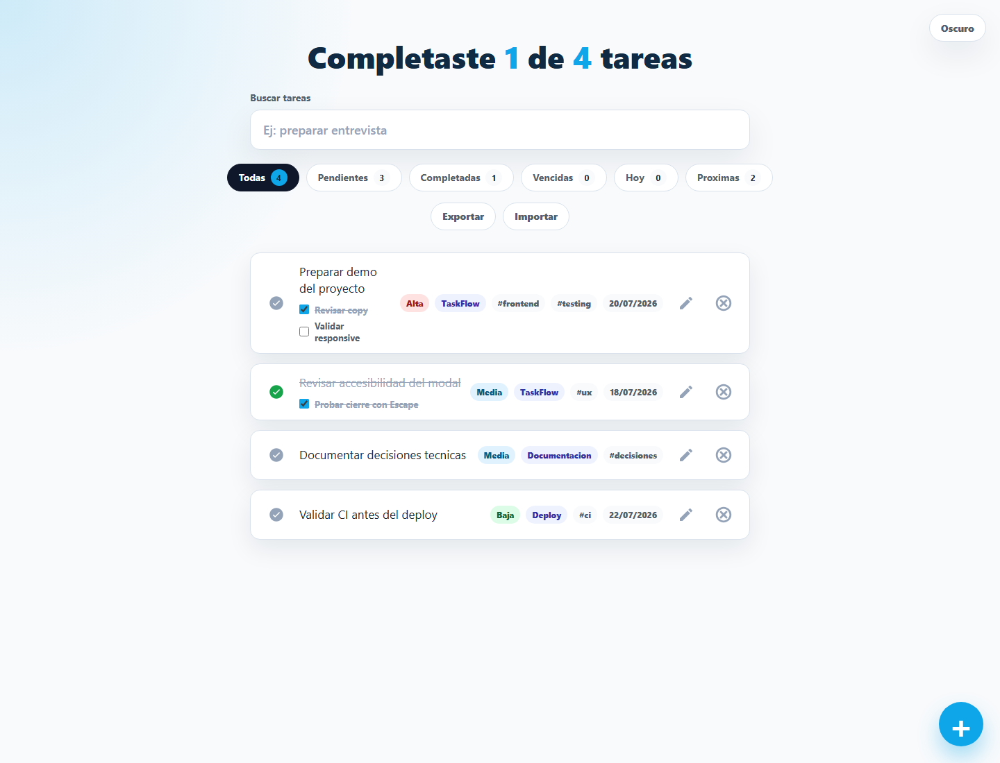
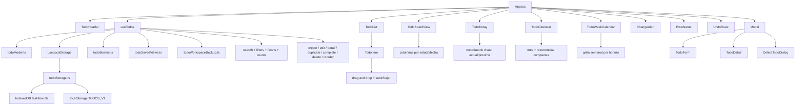

# TaskFlow - React ToDo List

[](https://github.com/LeandroMelchiori/React-ToDoList/actions/workflows/ci-cd.yml)


<p align="center">
  <a href="https://taskflow.sachadev.me">
    
  </a>
</p>

TaskFlow es una aplicacion React local-first para gestionar tareas, agenda y horarios sin backend. Permite trabajar con tareas completables, eventos, bloques recurrentes y periodos, manteniendo una base simple, probada y desplegable, con foco en separar estado, UI, modelo de datos y persistencia sin agregar complejidad innecesaria.

## Demo

- Produccion: https://taskflow.sachadev.me
- Repositorio: https://github.com/LeandroMelchiori/React-ToDoList

## Objetivo y alcance

La aplicacion parte de un flujo de tareas clasico y agrega comportamiento de producto sin salir de una arquitectura liviana:

- Gestion completa de tareas y agenda: crear, editar, completar, duplicar, buscar, filtrar y eliminar.
- Diferenciacion entre tareas completables, eventos puntuales, horarios recurrentes y periodos activos.
- Persistencia local en IndexedDB con migracion desde `localStorage`.
- Orden manual con drag and drop y controles accesibles subir/bajar.
- Validaciones para evitar entradas vacias y duplicadas.
- Estados visibles para carga, error, lista vacia y busqueda sin resultados.
- Sincronizacion cuando el almacenamiento cambia desde otra pestana.
- Soporte PWA con shell offline para abrir la app sin conexion luego de la primera visita.
- Exportacion e importacion de backups completos en JSON, mas exportacion e importacion de agenda en formato ICS.
- Recordatorios locales opcionales con notificaciones del navegador.
- Pruebas automatizadas y validacion continua antes de publicar cambios.

## Funcionalidades

- Crear tareas con validacion de texto vacio y duplicados.
- Editar tareas desde un modal con validacion de duplicados.
- Crear tareas completables, eventos de agenda, horarios/bloques recurrentes y periodos.
- Agregar descripcion, prioridad, fecha limite, fecha puntual, rango de fechas y horarios opcionales.
- Configurar repeticion diaria, semanal, mensual o anual segun el tipo de elemento.
- Ajustar recurrencias semanales por dias concretos, fecha de fin o cantidad maxima.
- Configurar recordatorios locales al momento, minutos antes o un dia antes.
- Organizar tareas por proyecto y etiquetas opcionales.
- Dividir tareas en subtareas tipo checklist con progreso visual y plegado.
- Completar automaticamente una tarea cuando todas sus subtareas estan listas.
- Ver el detalle completo de un elemento antes de editarlo.
- Duplicar tareas o elementos de agenda como copias limpias.
- Cargar plantillas iniciales desde el estado vacio.
- Marcar tareas como completadas o pendientes.
- Eliminar tareas con confirmacion previa.
- Deshacer una eliminacion reciente desde un aviso temporal.
- Buscar tareas por texto, proyecto o etiqueta.
- Filtrar rapidamente por proyecto o etiqueta.
- Filtrar por todas, pendientes, completadas, vencidas, de hoy o proximas.
- Guardar combinaciones de filtros para reutilizarlas.
- Separar el trabajo en tableros locales.
- Reordenar tareas con drag and drop o con controles subir/bajar.
- Alternar entre lista, vista de hoy, calendario mensual y agenda semanal.
- Usar una vista tipo tablero por estado para planificar visualmente.
- Visualizar eventos, horarios, tareas con fecha y periodos en calendario.
- Compactar tareas diarias repetidas para no saturar el calendario.
- Mostrar en Hoy el elemento actual o el proximo elemento con horario.
- Usar atajos de teclado: `/` enfoca busqueda, `n` abre el formulario de nueva tarea y el skip link salta directo a la lista.
- Persistir datos en IndexedDB, manteniendo compatibilidad con datos antiguos en `localStorage`.
- Normalizar tareas antiguas guardadas sin `id`.
- Detectar cambios hechos en otra pestana y permitir sincronizar.
- Exportar e importar el workspace completo con un archivo JSON local.
- Exportar elementos con fecha a un archivo `.ics` compatible con calendarios externos.
- Importar archivos `.ics` y fusionar eventos sin duplicar elementos existentes.
- Mostrar metricas locales de progreso, completadas recientes, vencidas y alta prioridad.
- Mostrar estado offline/PWA y avisar cuando hay una version nueva disponible.
- Mostrar estados de carga, error, lista vacia y busqueda sin resultados.

## Stack

- React 18
- TypeScript incremental
- Vite
- CSS por componente
- React Testing Library
- Vitest
- Playwright
- IndexedDB
- PWA / Service Worker
- Jest DOM
- GitHub Actions
- Vercel

## Calidad y entrega

| Senal | Estado |
| --- | --- |
| Auditoria de dependencias | `npm audit --audit-level=moderate` sin vulnerabilidades. |
| Tests unitarios/integracion | `npm test` cubre hooks y flujos principales de UI. |
| Typecheck | `npm run typecheck` valida las capas migradas a TypeScript. |
| Tests E2E | `npm run test:e2e` valida el flujo completo sobre el build de produccion local. |
| Lighthouse | `npm run audit:lighthouse` genera reporte del sitio publicado. Ultima medicion: 100/100/100/100. |
| CI | GitHub Actions ejecuta audit, tests, Playwright y build en cada push/PR a `main`. |

## Decisiones tecnicas

- Cada tarea usa un `id` unico para evitar depender del texto como key o identificador.
- Los datos antiguos se normalizan para mantener compatibilidad con tareas sin `id`, prioridad, proyecto o etiquetas.
- Las operaciones sobre tareas son inmutables: completar, borrar, agregar, editar y reordenar generan nuevas referencias.
- El modelo puro de tareas vive en `todoModel.ts`; ahi se normalizan datos, filtros, grupos, backups, recurrencias, calendario ICS y reordenamiento.
- Los modelos de tableros, filtros guardados y backups completos viven en archivos de dominio separados.
- La logica principal vive en hooks (`useTodos`, `useLocalStorage`) para separar estado y presentacion.
- IndexedDB es la persistencia principal y `localStorage` queda como compatibilidad, migracion y puente para eventos `storage`.
- El formulario se reutiliza para creacion y edicion, manteniendo validaciones consistentes.
- Las tareas completables se tratan distinto de eventos, horarios y periodos para que la agenda no contamine metricas de completado.
- El calendario mensual compacta tareas diarias recurrentes y la agenda semanal prioriza bloques con horario.
- Las reglas de recurrencia viven en el modelo para que lista, calendario, agenda semanal, recordatorios e ICS usen la misma interpretacion.
- La UI usa labels, botones accesibles, skip link, foco visible y estados claros para mejorar navegacion y feedback.
- Los recordatorios usan la Notification API del navegador y se programan localmente mientras la app esta abierta.
- El build usa base `/` para publicar correctamente en Vercel desde `taskflow.sachadev.me`.
- El toolchain usa Vite para reducir dependencias vulnerables y acelerar desarrollo/build.

## Arquitectura



El estado de negocio vive en `useTodos`; las reglas puras de tareas y agenda viven en `todoModel.ts`; la persistencia y sincronizacion con el navegador quedan aisladas en `useLocalStorage` y `todoStorage.ts`. Los componentes visuales reciben datos y callbacks, lo que mantiene la UI facil de probar y cambiar.

## Estructura

```txt
src/
  App/
    App.tsx
    todoBoards.ts
    todoModel.ts
    todoSavedViews.ts
    todoStorage.ts
    todoWorkspaceBackup.ts
    useTodos.ts
    useLocalStorage.ts
    usePwaStatus.ts
    useTheme.ts
  components/
    ChangeAlert/
    CreateTodoButton/
    Modal/
    PwaStatus/
    ThemeToggle/
    TodoBoardView/
    TodoCalendar/
    TodoHeader/
    TodoIcon/
    TodoList/
    TodoToday/
    TodoViewToggle/
    TodoWeekCalendar/
    UndoToast/
  serviceWorkerRegistration.js
public/
  manifest.json
  sw.js
tests/
  e2e/
```

## Scripts

Instalar dependencias:

```bash
npm install
```

Ejecutar en desarrollo:

```bash
npm start
```

Ejecutar tests:

```bash
npm test
```

Ejecutar TypeScript:

```bash
npm run typecheck
```

Ejecutar E2E sobre el build de produccion:

```bash
npm run test:e2e
```

Generar auditoria Lighthouse del sitio publicado:

```bash
npm run audit:lighthouse
```

Regenerar la captura demo del README:

```bash
npm run capture:demo
```

Generar build de produccion:

```bash
npm run build
```

Previsualizar el build:

```bash
npm run preview
```

## CI

El proyecto usa GitHub Actions para validar cada cambio. Vercel toma los cambios de `main` y publica automaticamente la version principal.

- En cada pull request o push a `main`: instala dependencias con `npm ci`, ejecuta `npm audit --audit-level=moderate`, corre tests, ejecuta typecheck, ejecuta E2E con Playwright y genera build.
- Vercel publica la app en `taskflow.sachadev.me`.

## Tests

La suite actual cubre:

- Normalizacion de tareas antiguas.
- Creacion de tareas con ids y texto limpio.
- Filtros por busqueda y estado.
- Filtros temporales por tareas vencidas, de hoy y proximas.
- Creacion, marcado y completado automatico de tareas con subtareas.
- Tareas, eventos, horarios recurrentes y periodos como tipos separados.
- Vista Hoy con tareas, agenda y recordatorio visual del horario actual/proximo.
- Vista Tablero con columnas por estado y apertura de detalle.
- Calendario mensual y agenda semanal con recurrencias.
- Reglas avanzadas de recurrencia semanal, fin por fecha y fin por cantidad.
- Recordatorios locales con permiso del navegador.
- Exportacion ICS de elementos fechados.
- Importacion ICS con preview y fusion sin duplicados.
- Tableros, filtros guardados y backups completos del workspace.
- Plantillas iniciales desde el estado vacio.
- Reordenamiento manual con botones y drag and drop.
- Flujo principal desde la UI: crear, validar, buscar, completar, filtrar y eliminar.
- Validacion de tareas duplicadas desde el formulario de creacion.
- Edicion de tareas desde modal y validacion de duplicados en edicion.
- Panel de detalle, duplicado de elementos y acciones desde el detalle.
- Cancelacion segura antes de eliminar una tarea.
- Deshacer una eliminacion reciente y autocierre del aviso.
- Navegacion por teclado, skip link, foco en modal y cierre con `Escape`.
- Exportacion e importacion de backups JSON.
- Metricas locales de progreso, completadas recientes, vencidas y alta prioridad.
- Estado PWA/offline y aplicacion de actualizaciones del service worker.
- Flujo E2E de produccion con Playwright: crear, buscar, editar, completar, cancelar borrado y eliminar.

## Mejoras futuras

- Mas plantillas locales para flujos recurrentes de estudio, talleres o proyectos.
- Migrar componentes y hooks restantes a TypeScript.
- Arrastre entre columnas del tablero para cambiar estado o fecha con reglas seguras.
- Excepciones puntuales de recurrencia, como saltear una clase o feriado.

## Autor

Desarrollado por Leandro Melchiori.
