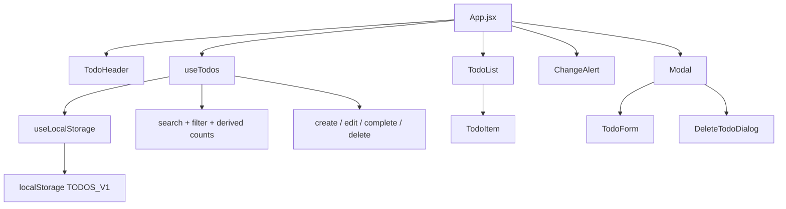

# TaskFlow - React ToDo List

[](https://github.com/LeandroMelchiori/React-ToDoList/actions/workflows/ci-cd.yml)


<p align="center">
  <a href="https://taskflow.sachadev.me">
    
  </a>
</p>

TaskFlow es una aplicacion React para gestionar tareas con busqueda, filtros, edicion, validaciones y persistencia local. El proyecto mantiene una base simple, probada y desplegable, con foco en separar estado, UI y persistencia sin agregar complejidad innecesaria.

## Demo

- Produccion: https://taskflow.sachadev.me
- Repositorio: https://github.com/LeandroMelchiori/React-ToDoList

## Objetivo y alcance

La aplicacion parte de un flujo de tareas clasico y agrega comportamiento de producto sin salir de una arquitectura liviana:

- Gestion completa de tareas: crear, editar, completar, buscar, filtrar y eliminar.
- Persistencia local con normalizacion de datos guardados previamente.
- Validaciones para evitar entradas vacias y duplicadas.
- Estados visibles para carga, error, lista vacia y busqueda sin resultados.
- Sincronizacion cuando el almacenamiento cambia desde otra pestana.
- Pruebas automatizadas y validacion continua antes de publicar cambios.

## Funcionalidades

- Crear tareas con validacion de texto vacio y duplicados.
- Editar tareas desde un modal con validacion de duplicados.
- Marcar tareas como completadas o pendientes.
- Eliminar tareas con confirmacion previa.
- Buscar tareas por texto.
- Filtrar por todas, pendientes o completadas.
- Persistir datos en `localStorage`.
- Normalizar tareas antiguas guardadas sin `id`.
- Detectar cambios hechos en otra pestana y permitir sincronizar.
- Mostrar estados de carga, error, lista vacia y busqueda sin resultados.

## Stack

- React 18
- Vite
- React Icons
- CSS por componente
- React Testing Library
- Vitest
- Jest DOM
- GitHub Actions
- Vercel

## Calidad y entrega

| Senal | Estado |
| --- | --- |
| Auditoria de dependencias | `npm audit --audit-level=moderate` sin vulnerabilidades. |
| Tests unitarios/integracion | `npm test` cubre hooks y flujos principales de UI. |
| Tests E2E | `npm run test:e2e` valida el flujo completo sobre el build de produccion local. |
| Lighthouse | `npm run audit:lighthouse` genera reporte del sitio publicado. Ultima medicion: 100/100/100/100. |
| CI | GitHub Actions ejecuta audit, tests, Playwright y build en cada push/PR a `main`. |

## Decisiones tecnicas

- Cada tarea usa un `id` unico para evitar depender del texto como key o identificador.
- Los datos antiguos guardados sin `id` se normalizan para mantener compatibilidad con usuarios existentes.
- Las operaciones sobre tareas son inmutables: completar, borrar, agregar y editar generan nuevas referencias.
- La logica principal vive en hooks (`useTodos`, `useLocalStorage`) para separar estado y presentacion.
- El formulario se reutiliza para creacion y edicion, manteniendo validaciones consistentes.
- La UI usa labels, botones accesibles y estados visibles para mejorar navegacion y feedback.
- El build usa base `/` para publicar correctamente en Vercel desde `taskflow.sachadev.me`.
- El toolchain usa Vite para reducir dependencias vulnerables y acelerar desarrollo/build.

## Arquitectura



El estado de negocio vive en `useTodos`; la persistencia y sincronizacion con el navegador quedan aisladas en `useLocalStorage`. Los componentes visuales reciben datos y callbacks, lo que mantiene la UI facil de probar y cambiar.

## Estructura

```txt
src/
  App/
    App.jsx
    useTodos.js
    useLocalStorage.js
  components/
    ChangeAlert/
    CreateTodoButton/
    Modal/
    TodoHeader/
    TodoIcon/
    TodoList/
```

## Scripts

Instalar dependencias:

```bash
npm install
```

Ejecutar en desarrollo:

```bash
npm start
```

Ejecutar tests:

```bash
npm test
```

Ejecutar E2E sobre el build de produccion:

```bash
npm run test:e2e
```

Generar auditoria Lighthouse del sitio publicado:

```bash
npm run audit:lighthouse
```

Regenerar la captura demo del README:

```bash
npm run capture:demo
```

Generar build de produccion:

```bash
npm run build
```

Previsualizar el build:

```bash
npm run preview
```

## CI

El proyecto usa GitHub Actions para validar cada cambio. Vercel toma los cambios de `main` y publica automaticamente la version principal.

- En cada pull request a `main`: instala dependencias con `npm ci`, ejecuta `npm audit --audit-level=moderate`, corre tests y genera build.
- En cada push a `main`: repite la validacion, incluyendo el flujo E2E con Playwright.
- Vercel publica la app en `taskflow.sachadev.me`.

## Tests

La suite actual cubre:

- Normalizacion de tareas antiguas.
- Creacion de tareas con ids y texto limpio.
- Filtros por busqueda y estado.
- Flujo principal desde la UI: crear, validar, buscar, completar, filtrar y eliminar.
- Validacion de tareas duplicadas desde el formulario de creacion.
- Edicion de tareas desde modal y validacion de duplicados en edicion.
- Cancelacion segura antes de eliminar una tarea.
- Flujo E2E de produccion con Playwright: crear, buscar, editar, completar, cancelar borrado y eliminar.

## Mejoras futuras

- Prioridades y fechas limite.
- Atajos de teclado para usuarios frecuentes.
- Modo oscuro.
- Drag and drop para reordenar tareas.
- Migracion a TypeScript.
- Backend con autenticacion y base de datos para soportar multiusuario y sincronizacion real entre dispositivos.

## Autor

Desarrollado por Leandro Melchiori.
