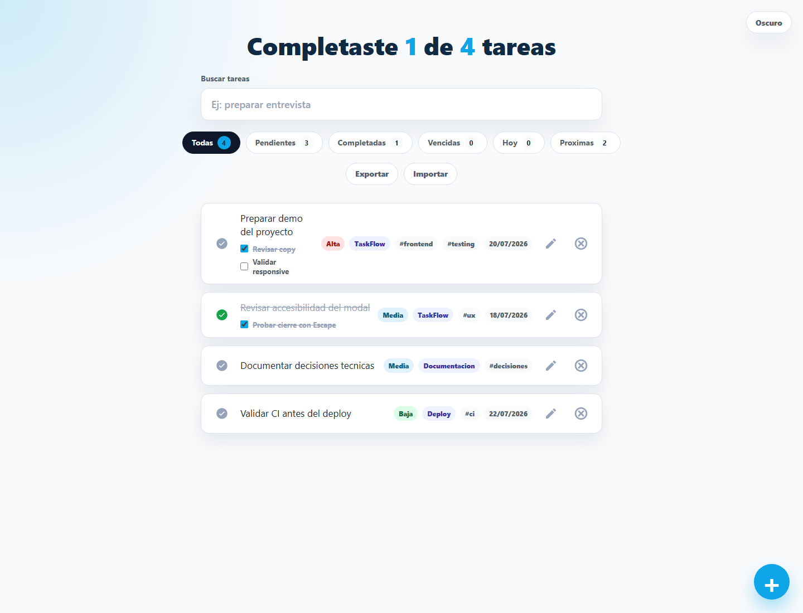
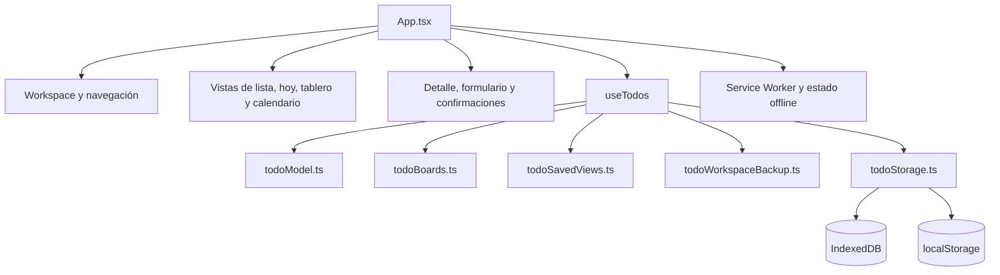

<div align="center">

# ✅ TaskFlow

### Gestor local-first de tareas, agenda y planificación personal

[](https://github.com/LeandroMelchiori/React-ToDoList/actions/workflows/ci-cd.yml)
[](https://taskflow.sachadev.me)


</div>

<p align="center">
  <a href="https://taskflow.sachadev.me">
    
  </a>
</p>

**TaskFlow** es una aplicación React local-first para organizar tareas, eventos, horarios recurrentes y períodos sin depender de un servidor o una cuenta de usuario.

La información se guarda en IndexedDB dentro del navegador, puede exportarse mediante backups y permanece disponible offline después de la primera visita.

🔗 **Aplicación publicada:** [taskflow.sachadev.me](https://taskflow.sachadev.me)

---

## 🎯 Enfoque del producto

TaskFlow comenzó como una lista de tareas y evolucionó hacia un workspace de planificación personal. El objetivo es ofrecer funciones avanzadas sin perder una experiencia rápida y comprensible.

- No requiere registro.
- No envía las tareas a un servidor.
- Funciona como PWA.
- Mantiene compatibilidad con versiones antiguas de los datos.
- Ofrece varias formas de visualizar la misma información.
- Usa Planificación como vista inicial del workspace para concentrar semana, próximos y pendientes.
- Incluye pruebas automáticas de comportamiento y accesibilidad.

---

## ✨ Funcionalidades

### Tareas y agenda

- Creación, edición, duplicación, finalización y eliminación de elementos.
- Tareas completables.
- Eventos con fecha, hora de inicio y hora de fin.
- Horarios o bloques recurrentes.
- Períodos con fecha de inicio y finalización.
- Prioridad, descripción, proyecto y etiquetas.
- Subtareas con progreso visual.
- Repeticiones diarias, semanales, mensuales y anuales.
- Fecha límite y recordatorios locales opcionales.
- Archivo de tareas completadas.
- Deshacer una eliminación reciente.
- Reprogramar bloques o una fecha de una serie recurrente y deshacer el cambio.

### Organización

- Tableros locales independientes.
- Orden manual mediante drag and drop.
- Controles accesibles para subir o bajar elementos sin arrastrar.
- Búsqueda por texto, proyecto o etiqueta.
- Filtros por estado, fecha, prioridad, recurrencia, recordatorios y tipo.
- Vistas guardadas para reutilizar combinaciones de filtros.
- Menú de opciones compacto para backups, importaciones y herramientas secundarias.

### Vistas de planificación

- Lista general.
- Vista Hoy con calendario diario, hora actual y desplazamiento inicial hacia ella.
- Vista de tres días consecutivos, también disponible en móvil.
- Calendario mensual.
- Agenda semanal con grilla horaria.
- Vista de Planificación que combina la semana, próximos compromisos y pendientes sin fecha.
- Agenda cronológica de próximos compromisos ordenada por fecha y hora.
- Tablero visual por estado.
- Bandeja de tareas vencidas visible incluso cuando el calendario tiene filtros activos.
- Reserva de tiempo mediante arrastre o formulario accesible, con aviso de conflictos.
- Colores y etiquetas de Trabajo, Estudio y Personal según el proyecto.
- Compactación de recurrencias diarias para evitar saturar el calendario.
- Carga diferida de las vistas de planificación para reducir el JavaScript inicial.

### Importación y exportación

- Backup completo del workspace en JSON.
- Vista previa antes de importar datos.
- Selección del tablero de destino.
- Fusión sin reemplazar automáticamente el contenido existente.
- Exportación de elementos con fecha en formato ICS.
- Importación de calendarios ICS.
- Detección de eventos duplicados.
- Adjuntos locales por elemento en IndexedDB para PDF, Word, texto e imagenes.
- Los adjuntos permanecen en el dispositivo y no forman parte de los backups JSON ni de la exportacion ICS.

### PWA y uso offline

- Instalación en escritorio y dispositivos móviles.
- Service Worker con shell offline.
- Aviso de nuevas versiones.
- Caché endurecida para evitar recursos desactualizados.
- Tipografía local disponible sin conexión.
- Indicador de estado offline.

---

## 🧠 Decisiones técnicas

### Local-first

IndexedDB es la fuente principal de persistencia. `localStorage` se mantiene para migrar versiones antiguas y para detectar cambios originados en otra pestaña.

La capa de persistencia:

- normaliza datos de versiones anteriores;
- evita bloquear la interfaz durante escrituras frecuentes;
- reduce serializaciones innecesarias;
- sincroniza cambios entre pestañas;
- permite trabajar con workspaces grandes sin agregar un backend.

### Modelo de datos

Cada elemento tiene un identificador estable y un tipo explícito. Las tareas, eventos, horarios y períodos comparten una estructura base, pero se interpretan de forma diferente en estadísticas y calendarios.

Las reglas de recurrencia se concentran en el modelo para que lista, Hoy, calendario, agenda, recordatorios e ICS produzcan resultados consistentes.

### Separación de responsabilidades

- `useTodos` coordina el estado del workspace.
- `todoModel.ts` contiene operaciones y reglas puras.
- `todoStorage.ts` abstrae la persistencia.
- `todoBoards.ts` administra tableros.
- `todoSavedViews.ts` administra filtros guardados.
- `todoWorkspaceBackup.ts` valida backups.
- Los componentes visuales reciben datos y callbacks para facilitar las pruebas.

---

## 🏗️ Arquitectura


```mermaid
flowchart TD
  App[App.tsx] --> Header[Workspace y navegación]
  App --> Views[Vistas de lista, hoy, tablero y calendario]
  App --> Modals[Detalle, formulario y confirmaciones]
  App --> Todos[useTodos]
  Todos --> Model[todoModel.ts]
  Todos --> Boards[todoBoards.ts]
  Todos --> Saved[todoSavedViews.ts]
  Todos --> Backup[todoWorkspaceBackup.ts]
  Todos --> Storage[todoStorage.ts]
  Storage --> IndexedDB[(IndexedDB)]
  Storage --> Legacy[(localStorage)]
  App --> PWA[Service Worker y estado offline]
```

Las vistas de calendario y planificación se cargan de forma diferida. Esto mantiene liviana la experiencia inicial y descarga módulos complejos solamente cuando el usuario los necesita.

---

## 🛠️ Stack

| Área | Tecnología |
|---|---|
| Interfaz | React 18 |
| Tipado | TypeScript 6, migración incremental |
| Build | Vite 8 |
| Persistencia | IndexedDB y compatibilidad con localStorage |
| PWA | Service Worker y Web App Manifest |
| Tests | Vitest, Testing Library y Jest DOM |
| E2E | Playwright |
| Accesibilidad | axe-core integrado a Playwright |
| Auditoría | Lighthouse |
| CI/CD | GitHub Actions y Vercel |

---

## 📂 Estructura principal

```text
src/
├── App/
│   ├── App.tsx
│   ├── todoModel.ts
│   ├── todoStorage.ts
│   ├── todoBoards.ts
│   ├── todoSavedViews.ts
│   ├── todoWorkspaceBackup.ts
│   ├── useTodos.ts
│   ├── useLocalStorage.ts
│   ├── usePwaStatus.ts
│   └── useTheme.ts
├── components/
│   ├── TodoList/
│   ├── TodoToday/
│   ├── TodoBoardView/
│   ├── TodoCalendar/
│   ├── TodoWeekCalendar/
│   ├── Modal/
│   ├── PwaStatus/
│   └── UndoToast/
└── serviceWorkerRegistration.ts

public/
├── manifest.json
├── sw.js
└── demo-taskflow.png

tests/
└── e2e/
```

---

## 🚀 Ejecución local

```bash
git clone https://github.com/LeandroMelchiori/React-ToDoList.git
cd React-ToDoList
npm install
npm run dev
```

La aplicación estará disponible en la dirección indicada por Vite.

### Build de producción

```bash
npm run build
npm run preview
```

---

## ✅ Calidad y pruebas

### Tests unitarios e integración

```bash
npm test
```

### Validación TypeScript

```bash
npm run typecheck
```

### End-to-end y accesibilidad

```bash
npm run test:e2e
```

La suite Playwright valida flujos de planificación, importación, persistencia, navegación y accesibilidad con axe-core.

### Auditoría de dependencias

```bash
npm audit --audit-level=moderate
```

### Lighthouse

```bash
npm run audit:lighthouse
```

La última medición documentada en el repositorio registra **99 / 100 / 100 / 100**. El script permite repetir la auditoría sobre la versión publicada.

### Benchmark local

```bash
npm run benchmark:storage
```

Mide el costo de serialización y persistencia con workspaces de hasta miles de elementos.

---

## 🔄 CI/CD

GitHub Actions ejecuta en cada push o pull request hacia `main`:

- instalación reproducible con `npm ci`;
- auditoría de dependencias;
- tests con Vitest;
- typecheck;
- pruebas E2E con Playwright;
- auditorías automatizadas de accesibilidad;
- build de producción.

Vercel publica automáticamente la rama principal en [taskflow.sachadev.me](https://taskflow.sachadev.me).

---

## 🛣️ Próximas mejoras

- Finalizar la migración del código restante a TypeScript.
- Añadir cifrado opcional a los backups locales.
- Mejorar la programación de notificaciones cuando la aplicación está cerrada.
- Ampliar las pruebas de importación ICS con calendarios externos.
- Seguir optimizando la experiencia móvil y el uso con lectores de pantalla.

---

## Autor

Desarrollado por **Leandro Melchiori**.

- [GitHub](https://github.com/LeandroMelchiori)
- [LinkedIn](https://www.linkedin.com/in/leandromelchiori-developer/)
