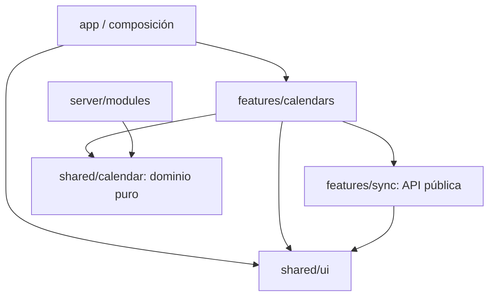

# Arquitectura modular por funcionalidades

TaskFlow conserva una sola aplicación React/Vite y una base preparada para una sola API: un monolito modular. Las funcionalidades existentes se agrupan por dominio; tema, PWA y composición permanecen en la capa de aplicación.

## Código implementado

| Ubicación | Responsabilidad | Entradas públicas |
| --- | --- | --- |
| `src/app` | Componer features y controlar tema/PWA | `App.tsx` |
| `src/features/calendars` | Agenda, tareas, horarios, vistas, formularios, backups y recordatorios | `CalendarWorkspace.tsx` |
| `src/features/sync` | IndexedDB, compatibilidad con localStorage, adjuntos y eventos externos | `storage.ts`, `useLocalStorage.ts`, `ChangeAlert.tsx` |
| `src/shared/calendar` | Reglas puras: normalización, recurrencias, conflictos, ICS, tableros y backups | Archivos de dominio, sin imports de React/CSS/persistencia |
| `src/shared/ui` | Modal, iconos, avisos y paleta de comandos | Componentes con datos y callbacks |
| `src/shared/hooks` | Comportamiento genérico del navegador, como media queries | Hooks reutilizables |
| `src/server/modules/meetings` | Intersección pura de disponibilidad común | `index.ts` |
| `src/server/contracts` | Comprobar integridad y privacidad del contrato OpenAPI | Tests, sin endpoints HTTP |

Los tests se mantienen junto al código que verifican. La suite de integración de toda la aplicación está en `app/App.test.jsx`.

## Dirección de dependencias

Las features nunca importan `app` ni código de servidor. `shared` nunca importa features. El servidor nunca importa UI, hooks o almacenamiento del navegador. El acceso entre features se hace por entradas públicas declaradas; los archivos internos de otra feature no son una API.

La lógica de calendario tiene una única implementación en `shared/calendar`. `calendarPresentation.ts` contiene los helpers puros antes alojados en `TodoCalendar.tsx`; las vistas semanal, diaria, de tres días y de agenda los consumen directamente. Así la vista mensual no se carga solo por usar uno de sus helpers.

## Módulos próximos

Cuenta, amistades, grupos y reuniones compartidas tienen guías de responsabilidad en sus carpetas de frontend y backend. Son límites para la implementación siguiente, no pantallas o servicios funcionales. La sincronización remota también sigue pendiente.

Cada nueva feature podrá incorporar sus `components`, `hooks`, validaciones y cliente HTTP cuando sean necesarios. Cada módulo de servidor podrá incorporar `routes`, `application`, `domain` e `infrastructure`; no crear implementaciones vacías para simular funcionalidad existente. Sus consumidores utilizarán una entrada pública pequeña, sin importar repositorios internos.

El ensamblado de servicios y adaptadores pertenece a `server`, fuera del dominio. Las rutas verificarán la sesión y delegarán en casos de uso; los repositorios encapsularán SQL. El cálculo de disponibilidad recibe intervalos ya autorizados y expandidos, no realiza autenticación ni accede a la base.

## Qué conserva esta migración

- Claves locales, nombre/versión de IndexedDB, normalización y formato de backups.
- Rutas públicas, manifest, service worker y registro PWA único desde `index.tsx`.
- DOM, clases CSS, interacción, carga diferida de vistas y paleta de comandos.
- Una fachada de estado `useTodos` dentro de calendario. Se puede dividir por casos de uso en iteraciones posteriores; no se mezcló una reescritura de estado con el movimiento de módulos.

`src/app/architecture.test.js` impide imports que rompan estos límites. TypeScript, los tests de integración, Playwright y las capturas visuales verifican la conservación del comportamiento.
