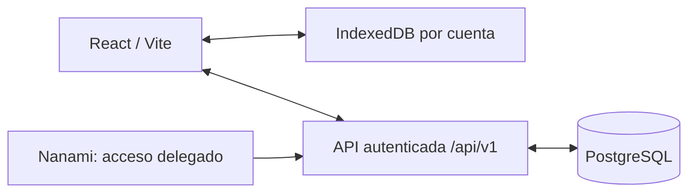

# TaskFlow: base multiusuario

Estado: diseño y lógica de dominio preparados; todavía no hay API HTTP, autenticación ni base remota activadas. La versión publicada continúa siendo local-first. Esta etapa define el modelo y el contrato antes de conectar un proveedor.

## Producto y alcance

Cada persona tiene su agenda, puede aceptar amistades, comparar disponibilidad individual y pertenecer a varios grupos. Los primeros cinco usuarios entrarán por invitación; el modelo no limita el producto a cinco personas ni a un grupo fijo. El registro público será una configuración posterior.

La primera entrega remota conservará tareas, eventos, horarios, períodos, recurrencias y excepciones, proyectos, etiquetas, subtareas y bloques de trabajo. Las reglas de esos elementos siguen en `src/App/todoModel.ts`. Los grupos sociales son entidades nuevas, diferentes de los tableros personales existentes.

## Arquitectura

- Mantener React/Vite y la PWA. La API podrá desplegarse mediante Vercel Functions con un runtime TypeScript; no es necesario migrar el frontend a Next.js.
- PostgreSQL contiene los datos compartidos. IndexedDB conserva la copia de la cuenta actual y la cola de cambios offline.
- `src/server/availability.ts` calcula intersecciones de disponibilidad. Recibe intervalos UTC ya autorizados y expandidos; no consulta usuarios ni almacena datos.
- El proveedor de identidad y el proveedor de PostgreSQL quedan pendientes de elección/configuración. El contrato usa una sesión verificada y no depende de un proveedor particular.
- `schema.sql` es un esquema inicial para revisar y ejecutar en un entorno de desarrollo cuando exista conexión. No fue aplicado a ninguna base.
- `openapi.json` describe las operaciones previstas; no anuncia endpoints disponibles en producción.

## Modelo de datos

| Entidad | Responsabilidad |
| --- | --- |
| users / auth_identities | Perfil estable y vínculos con identidades verificadas |
| groups / group_members | Grupos flexibles, invitación/aceptación y roles |
| friendships | Solicitud dirigida y aceptación mutua; relación única por pareja |
| calendars | Agenda personal o compartida; zona horaria propia |
| calendar_items | Elemento normalizado, identificador local, zona horaria y revisión |
| calendar_shares | Permisos explícitos de libre/ocupado o detalles para una persona o grupo |
| availability_windows | Días y franjas locales en las que se aceptan reuniones |
| meetings / meeting_participants | Propuesta, respuestas de participantes y confirmación |
| idempotency_records | Evitar escrituras duplicadas al reintentar |
| sync_heads / sync_changes | Cursor confirmado por usuario y cambios sanitizados |
| account_entitlements | Límites de uso independientes de amistades y agendas |

El identificador remoto de un elemento es UUID. Su `client_id` conserva el `Todo.id` actual, incluso si es un identificador antiguo; es único dentro de su calendario. Así la migración no tiene que cambiar referencias de subtareas o adjuntos locales. El JSON normalizado mantiene los campos existentes del dominio. El adaptador HTTP debe validar/normalizar el JSON antes de escribirlo y traducirlo al modelo actual al leerlo.

## Autorización y privacidad

1. Resolver el actor desde la sesión verificada. Nunca aceptar un `ownerId`, rol o identidad del proveedor enviado por el cliente como prueba de autorización.
2. Las agendas personales son privadas por defecto. Aceptar una amistad o un grupo no concede detalles automáticamente.
3. Comparación individual: amistad aceptada y permiso activo de libre/ocupado sobre cada calendario usado.
4. Comparación grupal: solicitante e integrantes seleccionados deben ser miembros activos, y cada agenda personal debe tener permiso de disponibilidad para ese grupo.
5. Libre/ocupado solo expone intervalos y revisiones de disponibilidad. Nunca títulos, descripciones, etiquetas, proyectos, adjuntos ni IDs de elementos privados.
6. Los detalles requieren un permiso explícito independiente. Compartir detalles tampoco concede escritura.
7. Solo el dueño modifica su agenda personal. En calendarios de grupo la escritura depende del rol activo. Solo destinatarios aceptan amistades/invitaciones; solo administradores gestionan miembros. Impedir abandonar/eliminar al último administrador sin transferir el rol.
8. Revocar permisos invalida las consultas futuras y emite una invalidación de caché. Salir de un grupo elimina el acceso derivado de ese grupo. Una amistad y una membresía siguen siendo relaciones independientes.
9. Toda consulta, exportación y sincronización aplica autorización. Una capa de caché nunca amplía permisos. El esquema activa RLS sin políticas, de modo que roles ordinarios quedan cerrados hasta implementar las políticas del proveedor. Una cuenta de servicio que omita RLS debe aplicar estas reglas explícitamente en la API.

## Disponibilidad y reuniones

- La API verifica permisos antes de obtener agendas y resolver recurrencias. Una agenda no autorizada o incompleta produce error; nunca se interpreta como libre.
- Expandir horarios recurrentes en su zona IANA y respetar finalización, conteo y excepciones. Convertir eventos y bloques a UTC para comparar usuarios de distintas zonas. Una hora inexistente o ambigua por cambio de horario requiere una política explícita y tests del adaptador antes de activar reservas.
- Los eventos antiguos sin hora de fin conservan la duración de compatibilidad de una hora. Las tareas sin fecha o sin bloque reservado no ocupan tiempo. Una fecha límite no equivale a un bloque de trabajo. Los períodos informativos no bloquean una jornada automáticamente.
- Cada participante aporta ventanas permitidas para reuniones; se restan eventos, horarios y bloques ocupados. Usar intervalos semiabiertos `[inicio, fin)`: una actividad puede terminar exactamente cuando empieza la siguiente.
- El mismo cálculo sirve para dos amigos o varios miembros de un grupo. El algoritmo entrega solo opciones comunes, ordenadas por inicio, con duración y granularidad configurables. La API limita el horizonte y el tamaño de la solicitud según el plan.
- Crear una reunión vuelve a comprobar permisos y disponibilidad dentro de una transacción. Bloquear filas de los participantes en orden estable, comprobar la revisión de disponibilidad y registrar la operación idempotente. Responder `409` si alguien dejó de estar disponible; no aceptar una sugerencia antigua sin comprobarla.
- Una propuesta invita a los demás, sin escribir arbitrariamente sus agendas personales. El organizador acepta su participación y cada destinatario responde. La reunión queda confirmada cuando todos aceptan; la última aceptación revalida disponibilidad, excluyendo la propia propuesta. Cancelar una reunión es una operación autorizada, versionada y sincronizada.

## Sincronización y migración

- Identidad, versión y cola de operaciones por cuenta. Al cerrar sesión no enviar su cola bajo otra cuenta ni dejar disponible en la UI su caché privada.
- Creaciones usan `Idempotency-Key`; modificaciones/borrados usan `If-Match` con una revisión. El servidor decide la nueva revisión. Un conflicto devuelve `409` y conserva la edición local para resolverlo.
- Mantener borrados como tombstones durante el período de retención, para que dispositivos offline no resuciten registros eliminados.
- El cursor de sincronización se obtiene de `sync_heads`, bloqueado por usuario durante la transacción. No usar un `bigserial` global como cursor de commit: dos transacciones pueden confirmar en distinto orden. Escribir el cambio y avanzar el cursor en la misma transacción; varios destinatarios se bloquean en orden estable.
- El feed se sanitiza por destinatario y se filtra según los permisos actuales. No guardar payloads privados en feeds de libre/ocupado. La revocación provoca invalidación y el siguiente sync puede exigir un snapshot nuevo.
- Importar el workspace local con vista previa y una operación idempotente por instalación/cuenta. Conservar tableros e IDs locales y no borrar IndexedDB al terminar. Verificar lecturas remotas antes de habilitar sincronización normal. Preferencias y copias locales continúan disponibles.
- Los adjuntos actuales permanecen locales. Su subida requerirá un flujo específico; no se incluyen silenciosamente en una migración o una consulta de disponibilidad.

## Secuencia de implementación

1. Elegir/configurar identidad y PostgreSQL de desarrollo; aplicar el esquema y políticas. Verificar accesos cruzados entre dos cuentas antes de activar HTTP.
2. Implementar sesión, perfil, calendario personal, operaciones normalizadas/versionadas e importación local. Mantener modo offline independiente.
3. Implementar amistades y permisos, luego consulta individual de disponibilidad.
4. Implementar grupos, invitaciones y propuestas de reunión con revalidación transaccional.
5. Añadir sync offline completo, invalidación de permisos y pruebas de dos dispositivos.
6. Incorporar Nanami mediante credenciales delegadas limitadas a una cuenta, auditoría de propuestas y aprobación de cambios.
7. Abrir registro/configurar suscripciones cuando el piloto esté validado. Los límites se resuelven en el servidor mediante entitlements; el modelo no contiene un límite fijo de cinco usuarios.

## Verificación y límites de esta etapa

El cálculo de disponibilidad tiene tests para dos/cinco usuarios, ventanas discontinuas, intervalos contiguos y solapados, falta de disponibilidad y entradas inválidas. TypeScript valida el módulo. El contrato JSON incluye respuestas de autorización, conflicto e idempotencia. Su sintaxis/referencias se pueden comprobar offline.

Todavía faltan el adaptador de autenticación, políticas ejecutables, repositorios SQL, expansión de recurrencias con zonas horarias, endpoints HTTP y pruebas contra PostgreSQL. El algoritmo por sí solo no autoriza usuarios ni confirma reservas concurrentes. Esta rama no cambia la aplicación publicada.

Referencias: [OpenAPI 3.1](https://spec.openapis.org/oas/v3.1.1.html), [restricciones de PostgreSQL](https://www.postgresql.org/docs/current/ddl-constraints.html), [Vercel Functions](https://vercel.com/docs/functions).
